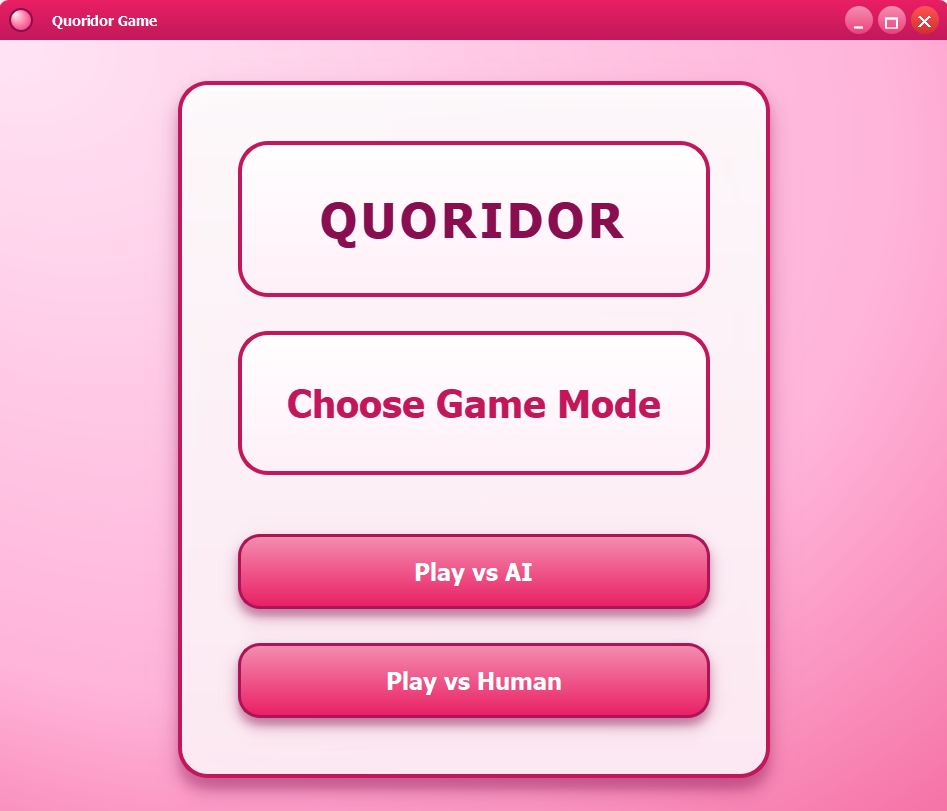
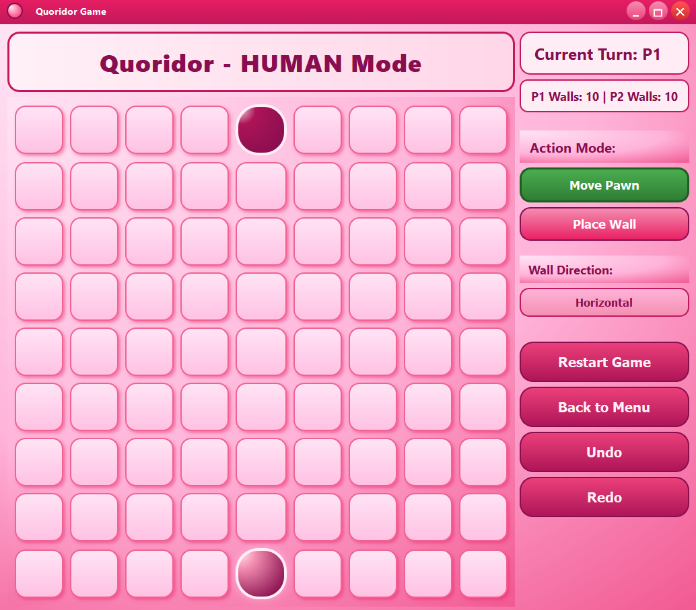
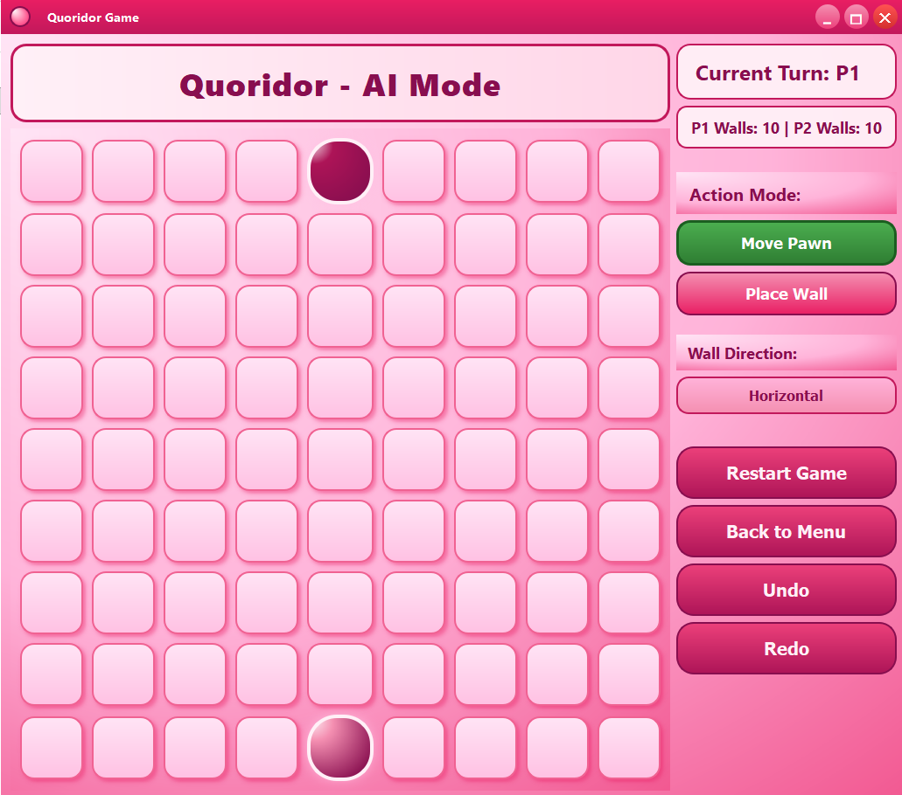

# 🎲 Quoridor Game

---

## 🌟 Overview

**Quoridor Game** is a complete implementation of the classic **2-player Quoridor board game**, featuring a **graphical user interface built with PyQt**, strategic **AI opponents**, and **full rule enforcement** according to the official game rules.

Players move pawns, place walls strategically, and compete either against another human player or an AI opponent with multiple difficulty levels.

---

## 🏁 Game Rules Summary

| Feature | Description |
|-------|-------------|
| Board | 9×9 grid |
| Players | 2 |
| Pawns & Walls | Each player starts with 1 pawn and 10 walls |
| Objective | Reach the opposite side of the board first |
| Pawn Movement | One square orthogonally; jump over adjacent opponent pawn if possible |
| Wall Placement | Two squares long; cannot overlap, cross, or fully block a player |

---

## 🚀 Features

### 🎮 Core Features
- Full 2-player Quoridor implementation with official rules 📜  
- Graphical board display with pawns, walls, turn indicator, and wall count 🖼️  
- Valid move highlighting and illegal move prevention ✅  
- Pathfinding ensures walls never block all paths 🔀  
- Human vs Human gameplay 🤝  
- Human vs AI gameplay with multiple difficulty levels 🤖  

---

### 🖥️ User Interface (PyQt)
- Click-based interaction for pawn movement and wall placement 🖱️  
- Turn indicator and remaining wall counters ⏱️  
- Game state messages (invalid moves, winner announcement) 💬  
- Game reset functionality 🔄  

---

### 🧠 AI Opponent

| Difficulty | Description |
|-----------|-------------|
| Easy | Greedy heuristic-based moves with minimal lookahead |
| Medium | Path-based evaluation with limited Minimax depth |
| Hard | Minimax algorithm with Alpha–Beta pruning and advanced heuristics |

---

## 🎮 Controls

| Action | How to Perform |
|------|---------------|
| Move Pawn | Click your pawn → Click a highlighted square |
| Place Wall | Enable wall placement mode → Click desired position |
| Reset Game | Click the **Reset** button |
| Undo / Redo | Ctrl + Z / Ctrl + Y (if implemented) |

---

## 🖼️ Game Screenshots

All screenshots are stored in the **`assets/`** folder.

### 🏠 Main Screen


---

### 👥 Human vs Human Mode


---

### 🤖 Human vs AI Mode


---

### ⚙️ AI Difficulty Selection


---

## 🛠️ Installation

### Requirements
- Python **3.11+**
- PyQt5

Install dependencies:
```bash
pip install PyQt5

---
## 🚀 Running the Game
```bash
git clone https://github.com/yourusername/quoridor-game.git
cd quoridor-game
python main.py
```

