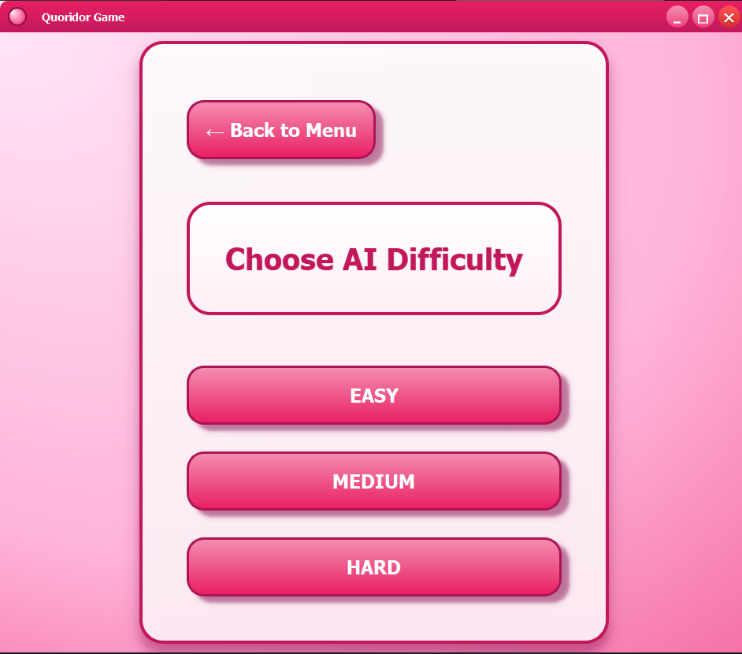

# 🎲 Quoridor Game
---

## 🌟 Overview

**Quoridor Game** is a fully-featured implementation of the **2-player Quoridor board game**.  
It includes a **graphical interface**, **AI opponents**, and **complete rule enforcement**.  

Players can move pawns, place walls strategically, and challenge a computer opponent with multiple difficulty levels.  

---

## 🏁 Game Rules Summary

| Feature | Description |
|---------|-------------|
| Board | 9×9 squares |
| Players | 2 |
| Pawns & Walls | Each player starts with a pawn and 10 walls | 
| Objective | Reach the opposite side of the board first |
| Pawn Movement | One square orthogonally; jump over adjacent opponent pawns if possible |
| Wall Placement | Two squares long; cannot overlap, cross, or fully block a player |

---

## 🚀 Features

**Core Features**  
- Full 2-player game with official rules 📜  
- GUI showing board, pawns, walls, turn indicator, wall counts 🖼️  
- Valid move highlighting & illegal move prevention ✅  
- Pathfinding ensures walls never block a player 🔀  
- Human vs Human gameplay 🤝  
- Human vs AI gameplay with strategic moves 🤖  

**User Interface (UI)**  
- Click-based controls for moving pawns and placing walls 🖱️  
- Turn indicator & wall count display ⏱️  
- Game state messages for invalid moves and winner announcement 💬  
- Reset game functionality 🔄  

**Bonus Features (Optional)**  
- Undo/Redo moves ↩️  
- Game state saving/loading 💾  
- Custom board sizes / 4-player mode 🛠️  


## 🧠 AI Opponent

| Difficulty | Behavior |
|------------|----------|
| Easy | Random valid moves, low lookahead |
| Medium | Evaluates shortest paths + basic wall strategy |
| Hard | Full Minimax with Alpha-Beta pruning + path heuristics |

---
## 🎮 Controls

| Action     | How to perform                       |
|------------|--------------------------------------|
| Move Pawn  | Click your pawn → Click highlighted square |
| Place Wall | Enable wall mode → Click desired edge |
| Undo/Redo  | Ctrl+Z / Ctrl+Y (if implemented)    |
| Reset Game | Click "Reset" button                 |
---
---

## 🖼️ Game Screenshots

### 🏠 Main Screen


### 👥 Human vs Human Mode


### 🤖 Human vs AI Mode


### ⚙️ AI Difficulty Selection


---

## 🛠️ Installation

### Requirements
- Python 3.11+  
- Pygame library
```bash
pip install pygame
```
---
## 🚀 Running the Game
```bash
git clone https://github.com/yourusername/quoridor-game.git
cd quoridor-game
python main.py
```

